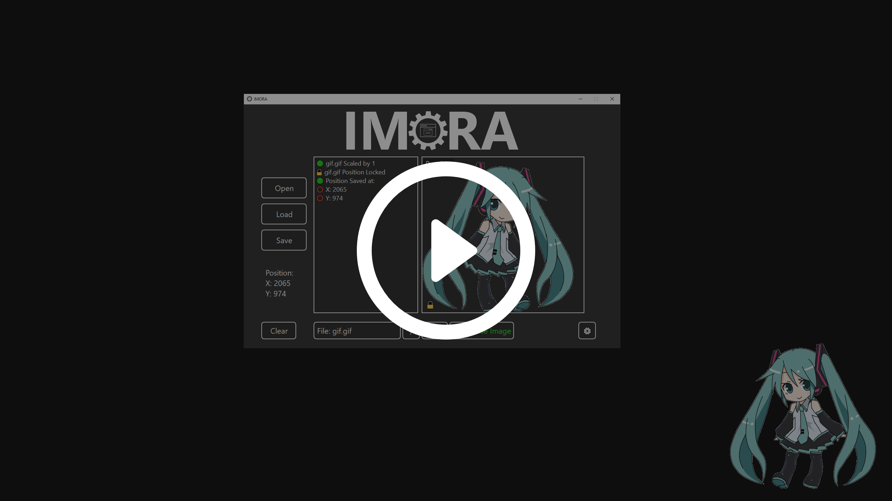

# IMORA

<p align="center">
  
</p>

[](https://forthebadge.com)
[](https://forthebadge.com)

 

[](https://github.com/Emco878/IMORA/releases/latest)

# 📌 Description
**IMORA** is a tool that allows you to add an image or a GIF as overlay on your screen.

## 🛠️ Installation
Download the latest release version of [IMORA.exe](https://github.com/Emco878/IMORA/releases/latest)

>⚠️ **Note**: This app is now signed however SmartScreen may warn you as my repuration is low. The program is safe. The source code, can be found in `main.py`

## ✨ Features
- Save Image/GIF position
- Lower the Scale of the Image / GIF
- Hide application in taskbar
- Simple and easy-to-use interface

## 🎥 Demo
[](https://youtu.be/LKbjeREnaUc)

## 📜 Instructions
UI
- Open Button: Opens the sources folder which should hold all your Images and GIFs.
- Load Button: Loads the Image or GIF on the screen.
- Save Button: Saves the Position of the Image or GIF.
- Clear Button: Clears the Console.
- [1 - 9] Input: Number of times to decrease the scale of the Image or GIF.
- ⚙ Settings: Opens `settings.json` which stores the image, scale, and its coordinates.
- 🔒 Lock: Prevents the Image or GIF from being dragged and locks it in place.

Steps:
- Download any .png .jpg .jpeg or .GIF and import it into your `sources` folder.
- Click Load and drag the image anywhere on your screen.
- Click Save to save the position of where the Image or GIF is on your screen.

## ⚠️ Fail-Safes
There are 3 possible error messages:
- ❗ No File to Load
    - No Image or GIF has been opened to load.
- ❗ No Position to Save
    - No Image or GIF has been opened to save.
- ❗ Settings.json does not exist
    - The settings file has not been created yet or it may have been deleted. To reinstate it, just simply save the position of any Image or GIF.

## 📦 Requirements
- Python 3.12 (Recommended)

## 👨‍💻 Development
Want to contribute? Great!

- Fork the repository: click the `Fork` button at the top-right of the page
- Your fork will be at: `https://github.com/your_username/IMORA`

Clone the repo using:

```bash
git clone https://github.com/your_username/IMORA.git
```
 🔗 For more help: [Contributing To a Project](https://docs.github.com/en/get-started/exploring-projects-on-github/contributing-to-a-project).

## 📝 License
[MIT](https://choosealicense.com/licenses/mit/)